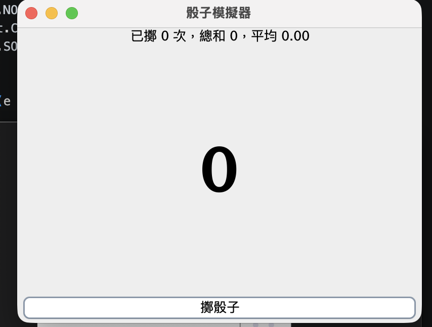
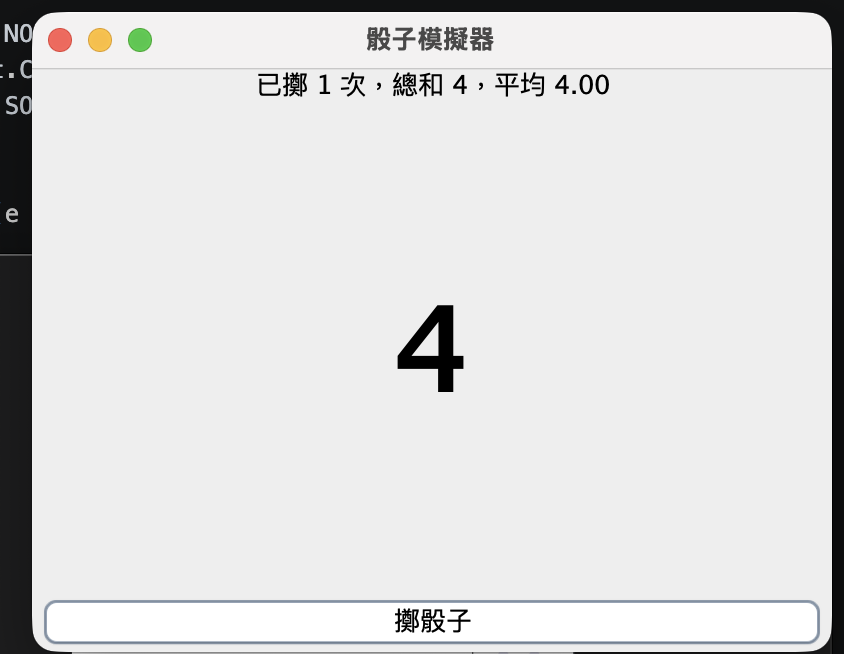
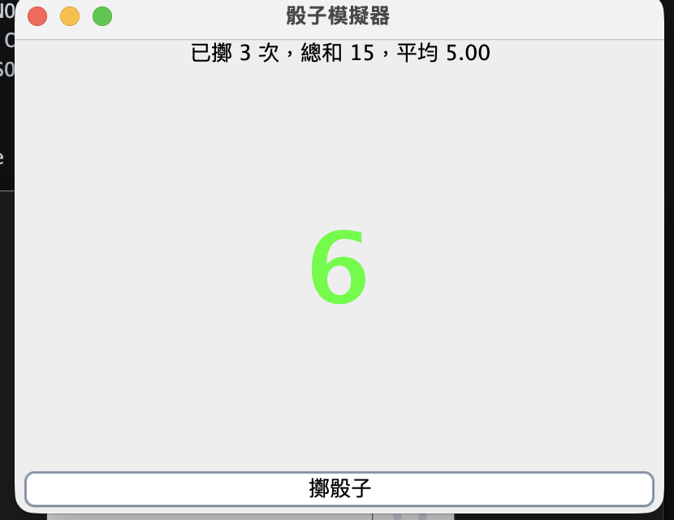
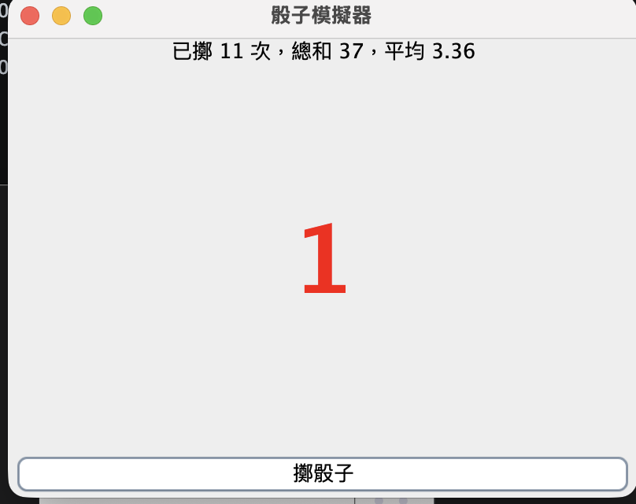

# 骰子模擬器截圖

由使用者於 2026-10-06 提供，保留原始 PNG 內容，依拍攝順序命名。

| 證據 | 原圖時間 | 畫面內容 |
| --- | --- | --- |
| [result-01.png](result-01.png) | 10:51:15 | 初始點數 0；0 次、總和 0、平均 0.00 |
| [result-02.png](result-02.png) | 10:51:24 | 黑色 4；1 次、總和 4、平均 4.00 |
| [result-03.png](result-03.png) | 10:51:33 | 綠色 6；3 次、總和 15、平均 5.00 |
| [result-04.png](result-04.png) | 10:52:02 | 紅色 1；11 次、總和 37、平均 3.36 |

## 初始狀態

## 一般點數：黑色

## 點數 6：綠色

## 點數 1：紅色

原始題目截圖仍待提供；AI 對話已依使用者同意改存為 [Markdown 紀錄](../AI-CONVERSATION.md)，不再要求 AI 對話圖片。

[測試紀錄](../TESTING.md) · [返回作業](../README.md)
